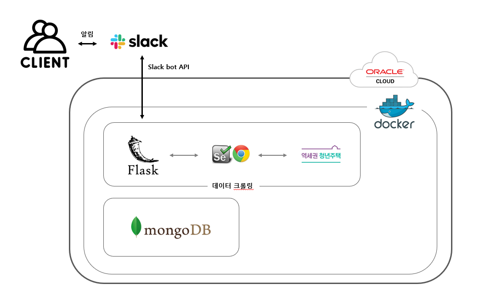

# 역세권 청년주택 알리미, YouthHousing

실시간으로 올라오는 ⏰<a href="http://house.youthalarm.kro.kr:5000/" target="_blank">공고 알림</a> 받으러 가기

## 기능 구현
 - 역세권 청년주택 공고를 스케줄러를 통해 주기적으로 크롤링 실행
 - 새로운 공고를 슬랙 봇과 연결하여 채널 알림
 - 도커를 활용해 프로젝트 서버 운영/배포

## 기술 스택
 - Language : `Python`
 - Library & Framework : `Flask` `selenium` `pymongo` `schedule` `requests`
 - Database : `MongoDB`
 - Target : `Web Browser(chrome)`
 - etc : `Slack` `Oracle linux8` `Docker`
 
####  해당 스택을 선택한 이유
 - `Flask` : 제약이없고 1개의 어플리케이션을 개발할 목적으로 마이크로 프레임워크인 Flask 사용
 - `MongoDB` : 단순 알림 앱으로 데이터베이스의 일관성보다 가용성, 속도를 추구했기 때문에 NoSQL로 선택
 - `Slack` : 개인 프로젝트로 서버(프리티어 버전) 사양이 낮아 각 사용자에게 알림을 보내기보다 슬랙봇과 채널 자원을 사용
 
## 시스템 구조

## 배포 방식

 - `docker build -t yoonwooseong/youth_housing:태그 .`
 - `docker push yoonwooseong/youth_housing:태그`
 
 배포 서버
 - `docker pull yoonwooseong/youth_housing:태그`
 - `docker run -d -p 0.0.0.0:5000:5000/tcp yoonwooseong/youth_housing:태그`

## 개발자
 - yoonwooseong
